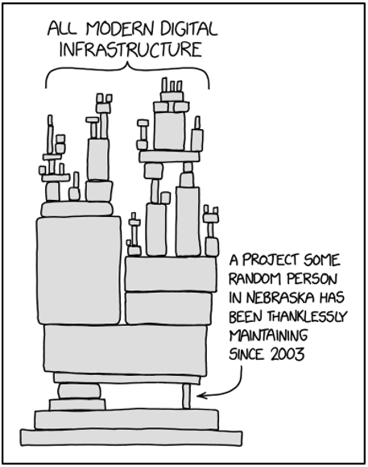

# Consumption and Compliance 

Free open source software has become a fundamental building block of commercial software across most industry categories. The business reasons for consuming free open source software range from leveraging common functionality for lowering development costs, via alignment with open APIs, to participation in entire ecosystems based on customer demand.

In any case, consuming free open source software must always be based on a clear understanding of the business rationale as well as mid- and long-term implications and not only the obvious short-term gain. In particular, any professional consumption of free open source software needs to make sure to be in compliance with not only the granted license terms but also the company policy for developing with free open source software.

Additionally, consuming free open source software comes with security considerations needed and possible activities to identify and mitigate potential risks. Examples of these are, awareness of community producing and maintaining as well as the software itself and what it might contain.

Consumption can be subdivided in mainly two areas such as 1) product development and 2) supporting systems for product development. Different policies can be applied for managing risk exposure and dependencies.

## Strategy/policy
The company needs to have a strategy and/or policy in place on how to develop with open source software included in its products. This involves having a structure in place where decisions for what and how such development can take place, but also what free open source software to allow or not and in what type of development.

Such strategy or policy might also be needed on product or product area level.

*Image by Randall Munroe (https://xkcd.com/2347/)*

The strategy for consuming free open source software should consider the following aspects:

-	**Community and project health:** This includes, but isn’t limited to, aspects such as activity of the community, number of contributors and diversity of contributing organizations. The purpose of these aspects is to allow a risk analysis regarding future stability and dependability of the open source component. These aspects should be recurringly reviewed. 

-	**Consumption:** The source code shall always be available to be able to take over the "ownership" in the case it becomes necessary. For instance, when the community changes the license to become unusable for the intended purpose, or the community just fades or gets lost.

-	**Security:** Free open source software is effectively being developed, hosted, and built by external developers and on external infrastructure. As a result, it is imperative to conduct security scans of all open source software before consumption, targeting malware as well as known vulnerabilities. Additionally, a risk assessment of using a given free open source software as part of a commercial product should be conducted. Finally, once introduced into product development, every free open source software component must be continuously monitored for vulnerabilities. 

-	**License and compliance with IPR (Intellectual Property Rights):** All usage of free open source software, internally and in products shipped to customers, must be compliant to all obligations declared in the respective open source licenses. 

## Instructions and guidance
Creation of open source instruction(s) and guidance documentation will help a company to successfully consume free open source software in a uniform, compliant and secure way.

In the absence of such instructions or guidance you need to seek or create appropriate instructions to secure the usage of open source in your project.
The instruction(s) might define roles needed to perform the open source handling within the company.

Supporting guidance documentation might help to clarify what is to be expected in the actual implementation of the instruction for open source software handling.

## Open Source Governance setup
One way of organizing the consumption within a company/corporation is by establishing a unit/team/program (usually called Open Source Program Office (OSPO)) within the company to be responsible for the company governance of free open source software.

Companies with an established OSPO tend to get more value out of its open source consumption according to recent studies performed by the Linux Foundation Research.

Other known ways to organize the consumption is by having a centralized policy group defining basic consumption rules where each development line/project can act. The drawback of this setup is the lack of opportunity to share experiences through-out the company unless there are methodology and tools supporting sharing.

There also seems to be a correlation between the size of the company and the willingness to invest in a dedicated team for open source governance where larger companies (with more employees) more often choose such a setup.

It is however noteworthy that OSPO is an implementation choice where the goals can be reached by other means.  Those goals are typically to 

1. Gain a strategic view of, and engagement in open source. 
2. Better leverage the free open source software consumed by the organization, 
3. Manage legal risks and compliance matters in a uniform manner across the organization. 

# Available standards for open source compliance

## Open source handling process
The purpose of a common free open source software handling process is to achieve a uniform way of working within the whole company. Such a process supports the possibility to provide an auditable description of the open source handling and thus providing trust, and possibly fulfilling regulatory requirements.

A company level process will most likely need to have its local adaptations to suit local development practices and/or requirements, but these should still fulfill the major intentions and checks of the overall process.

Part of such a company process is the open source introduction process which aims at having a uniform introduction with harmonized data creating company common understanding of the free open source software for development decisions.

## Roles and responsibility
When developing with free open source software several roles are needed. Most of these roles will be shared with roles for developing proprietary software but some are unique.

Open source roles need to be described in terms of obligations and mandates.
Obvious roles are the software designer and the responsible designer, but you also need roles to secure the compliance and governance part of open source development. Depending on the company structure this might be layered.

## OpenChain (ISO 5230:2020)
ISO/IEC 5230 (known as OpenChain) is an international standard on the key requirements for a high-quality free open source license compliance program. The standard was published jointly by the International Organization for Standardization (ISO) and the International Electrotechnical Commission (IEC) in late 2020. The standard is based on the Linux Foundation OpenChain Specification 2.1. It focuses on software supply chains, easier procurement and license compliance.

## Documentation of software composition
Documentation to declare included free open source software components as either a part of a license obligation, customer requirement or regulatory requirement can be done in many ways where the Software Bill of Material, SBOM, is one way of representing the product content. Either to support human or machine readability.

Suggested formats are being developed both for general consumption and for industry niches like automotive, health and telecom. There is a standard for the data format (SPDX) for this in place. ISO/IEC 5962:2021

[Link to NTIA requirements on SBOMs >>](https://www.ntia.doc.gov/report/2021/minimum-elements-software-bill-materials-sbom) 

## Security strategy when selecting open source components
The expectation that a lively and active community will provide patches/security fixes quicker is one of the drivers when selecting components.
Should you go for the latest or second latest as your strategy. Different opinions exist with pros/cons. Version upgrade compatibility is something to consider.

## Commercial vendors / Mergers & Acquisitions
Free open source software issues must also be adequately addressed in third party contracts, development agreements, distribution agreements, acquisitions, and other transactions. 

# Basics of Contribution

## Introduction
A fundamental part of open source software is the contributions from community engagement made possible by the openness and granted freedoms. The reasons for contributing to free open source software projects vary and range from bug reporting/fixing and testing to feature additions and documentation. Building competence ensuring self-support for critical software in a professional context is another reason.

Regardless of your reason, a decision to professionally contribute is needed and shall include how to do it, to what level, and a valid purpose. Done correctly, having a sound contribution culture within the company will further benefit the free open source software consumption, minimize risk and establish the company as an active member of the open source community and an attractive employer for software developers.

## Contribution strategy
Any organization contributing to open source software development need to have a strategy in place which defines criteria for when to engage, to what level and for what reasons as part of the contribution and decision process. Professional contribution also needs careful consideration of community terms and conditions before a contribution is to be made to protect any IPR.

Contribution should also follow an established process with assigned roles and responsibilities for those involved in the process.

## Decision process
Consideration of the pros and cons of engaging in an open source community should take place even if the opportunity to contribute is aligned with the defined strategy. Such consideration should cover the benefits such as potential influence on the community development direction, increased competence, shorter response time for bug fixes and reputation but also the terms and conditions for contributing with potential consequences like exposing patents, exposed technological advantages, or cost of resources.

Various roles should be involved in the decision process within a professional software development setup. The roles should cover aspects for the contributor, legal and the business owner. The formal decision shall be documented for future reference and signing of any Contribution License Agreement (CLA).
# Basics of Export Control 

## Introduction
Export Control is a legal term and concerns regulation for the export of goods, software, and technology. Historically, export control started in 1949, with the founding of the CoCom organization to keep technology within the Western alliance. It was later replaced by the Wassenaar Arrangement (WA). All member states of the Wassenaar Arrangement must follow the controls in the WA control list but may add other controls through national policies.

US Export controls are Extraterritorial and means that if the product/software is of “US Origin”, US export regulations must be followed where-ever the product is to be exported.

Any technology with the possibility to be used in both civilian and military purposes is considered as dual use technology and are subject to export control.

Software is export controlled in the following aspects: 
-	Software made exclusively as either component of a listed item;
or development, production, maintenance, analysis of a listed item;
or emulation of a listed item;
or use of a listed item
-	Software that is weapon in itself (e.g., intrusion software, viruses, etc.)
-	Software that provides encryption/decryption functionality

In general, most export control focus for software involves cryptographic algorithms which are used to obscure or hide information during transmission through encryption/decryption functionality. The obvious example is the German Enigma machine from the second world war which of course isn’t a software implementation due to the lack of computers back then.

*Image: Wikipedia

Cryptographic algorithms are categorized from very weak to very strong with export classification being more restricted when the encryption is stronger and harder to break.

Export control can be further limited through country declaration of restricted nations. Lists of such restricted nations are for instance maintained by the United States of America, the European Union and the United Nations.

## Free open source software as an export controlled item
Free open source software is today not export controlled by EU, US, or [the Wassenaar Arrangement, WA >>](https://www.wassenaar.org/)  

Professional development including free open source software for products to be exported must be documented and export control classified if cryptographic functionality is included.

Usually, the export control classification of software results in the following: 
-	The manufacturer provides a classification that may be from the Munition List or Dual Use List.
-	The presence of strong encryption code or security protocols classifies it as Dual Use software (5D002). 

