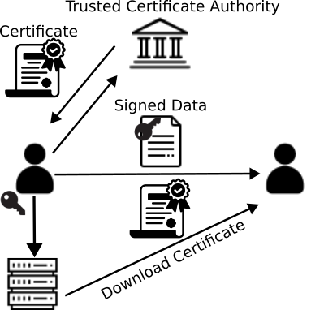
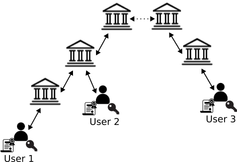

# Public Key Infrastructure

### _Outline_ 📋
In this chapter, we learn about
- The use of [Public Key Cryptography](#public-key-cryptography)
  - A brief [Introduction to GPG](#introduction-to-gpg)
- The concepts of [Public Key Infrastructure](#public-key-infrastructure-1)
  - The use of [CA Hierarchy to ensure Trust](#certificate-authority-hierarchy-to-ensure-trust)
  - How can we [Revoke Keys](#revoke-keys)
- Some basic, but important, steps for [Handling credentials](#credential-handling)

We also encourage you to explore the links throughout the text, the [Do-It-Yourself](#diy) tasks, as well as the resources listed in the [references](#references).

## Public Key Cryptography

In public key cryptography, every user or system utilizes a pair of keys; called `public` and `private` keys.
While the `public` key can be freely distributed to the world, e.g., posted on a website or send through a messaging service, the corresponding `private` key must remain secret. By using these pair of keys the following
are possible:

- Some piece of data can be encrypted using the `public` key of someone else. This guarantees that only the person
holding the corresponding `private` key can decrypt it. This guarantees the *confidentiality* of the information.
- Encrypting, or better yet `signing` some piece of data with the `private` key means that everyone in possession
of the corresponding `public` key can decrypt (or `verify`) the information. This, does not provide confidentiality, but provides non-repudiation, i.e., we can claim that the data came from someone in possession of the secret key. Forgery in this case is not possible. 
  
The second bullet highlights the importance of keeping the private key secure; leaking this key would allow anyone to impersonate its actual holder. This becomes even more critical when we consider the usecases of public key cryptography:

- Use in [SSH](https://en.wikipedia.org/wiki/Secure_Shell), for establishing secure tunnels to remote machines; used in [Transport Layer Security (TLS)](https://en.wikipedia.org/wiki/Transport_Layer_Security) that provides communication security in computer networks (including HTTPS).
- Usa in messaging services such signal, telegram, whatsapp and many more.
- Algorithms of this nature also help in key distribution (e.g., the [Diffie-Hellman](https://en.wikipedia.org/wiki/Diffie%E2%80%93Hellman_key_exchange) exchange) and other notable systems such as [RSA](https://en.wikipedia.org/wiki/RSA_(cryptosystem)), which are used daily by almost everyone in the world.

In the context of code infrastructure security, a compromised `private` key would allow anyone to `push` to a specific branch, `sign` the code such that it appears to originate from someone else, such as [Linus Torvalds](https://github.com/torvalds); thus, hiding potential malicious code. Similarily, an update for one of the packages in our supply chain can be the point of entry for malicious code. If the `private` key of the package provider is compromised, the update will be downloaded and incorporated automatically. In both cases, malicious code is introduced into the supply chain due to the inherent trust to the user and the cryptosystem.

### Introduction to GPG

A valuable tool to test the above is [GPG](https://en.wikipedia.org/wiki/GNU_Privacy_Guard); which is compliant with the [openPGP](https://en.wikipedia.org/wiki/Pretty_Good_Privacy#OpenPGP) specification. For this section of the course we will only use some basic commands:

- To generate a key, we can simply run: `gpg --gen-key`. This will create an 3072-bit length RSA key. For a complete parameterized key generation, one can execute `gpg --full-generate-key`.
- To encrypt a file we can run the following command `gpg -er <recipient_key_id> <file>`. This will use the `public` key of the intended recipient (`-r`) to encrypt.
- Similarily, to decrypt a file we can use: `gpg --decrypt <file>`. Notice here that we do not need to specify which key we want to use, gpg will do it automatically.
- To sign or verify some piece of data we can use: `gpg --sign <file>` or `gpg --verify <file>`. 
  - It should be noted that, in cases where we both enrypt and sign, e.g., `gpg -se <file>`, we do not need to execute `--verify` on the receiving end, only `--decrypt`, which will also perform the verification.
  - The reason for this is simple: we first sign the data and then encrypt them. Thus, verifying the resulting blob results in an error; we first need to decrypt and then verify the sender.

A complete man page for gpg can be found [here](https://manpages.org/gpg)

## Public Key Infrastructure

However, simply using a pair of keys to encrypt/decrypt and sign/verify some piece of data does not guarantee that the information came from a specific user. Ultimately, a pair of keys is not tied to a person or a system. To solve this problem, an infrastructure is required in order to bind these two aspects together. Public Key Infrastructure, or [PKI](https://en.wikipedia.org/wiki/Public_key_infrastructure), is a set of entities, with distinct roles, responsible for managing digital certificates. This includes their generation, storage, distribution, and revocation. These certificates can then be used to authenticate a user, or a machine, to a service. Simply, a user can provide his `public` key to a [Certificate Authority (CA)](https://en.wikipedia.org/wiki/Certificate_authority), prove his identity to that authority, e.g., by physically going to an office, which will then create a certificate containing the identity of the user and the `public` key. This, guarantees that the `public` key (or certificate) distributed to the web is bound to a specific person or system.

The following is a simple illustration of the role of the PKI when data need to be sent to a third-party. The user needs to register to a trusted certificate authority, which creates the certificate out of the `public` key of the user and its own `private` key. This key can then be freely distributed and stored to online databases. When some piece of data/email/code is sent to a third party, the third party can use the public certificate to `verify` that the sender corresponds to the correct entity. Thus, trusting their ownership!

As long as the certificate authority is trusted by all parties, a user can be sure that the communication happens with the intended recipient.

To bring it to the context of supply chains: The PKI helps ensure that the downloaded software was produced by a specific entity; it can also ensure that the code has not been changed during the lifetime of the supply chain (if signing/verification happens at each step). Moreover, the PKI can also be used to trace published code to a specific individual. In a typical supply chain, the truck driver that performs a delivery would provide an ID to the factory and the store; in the software supply chain, this is accomplished with the use of credentials.

### Certificate Authority Hierarchy to ensure Trust
In the previous section we discussed the concept of CAs. Different parties in the world need to all trust the same authority for the PKI to function correctly; this is handled by a hierarchy of CAs where each one delegates trust to the CAs that reside underneath it. At the top of the chain reside a selective few root CAs that self sign their own certificates; the rest need to be certified by these authorities in order for them to be trusted. 

However, this does not necessarily solve the mutual trust problem. A certificate issued in the hierarchy of one root CA cannot necessarily be trusted by someone using a different root, i.e., when two devices do not trust the same roots. To solve this problem, CAs can cross validate their certificates, i.e., two CAs mutually sign each other certificates. This cross-certification delegates trust and allows the validation of the credentials of the devices. Present day browsers typically contain all the necessary root authorities for them to function, whereas cross-certification can be used in scenarios were localised CAs may be more preferential, e.g., in an [Intelligent Transportation System (ITS)](https://en.wikipedia.org/wiki/Intelligent_transportation_system). 

The following is a group of users, belonging to different CAs, who want to communicate with each other. Users 1 and 2 belong to the same root CA, while User 3 belongs to a different one. In order to mutually authenticate, trust needs to exist in the hierarchy of CAs. For Users 1 and 2, this is easier because they share the same ancestor: the same CA that produced the certificate for User 2 also created the certificate for the CA that handles User 1. This delegation of trust allows them to authenticate each other. In order for User 3 to do the same, the root CAs need to cross-certify each other; i.e., to trust that they perform their duties correctly and the hierarchy underneath them can be trusted!

### Revoke Keys
It is important that when a `private` key is compromised, all information that is signed using this key is not to be trusted (including certificates issued by CAs). However, how can everyone be aware of this compromise in order to revoke trust? The solution comes in the form of a [Certificate Revocation List](https://www.rfc-editor.org/rfc/rfc5280); these lists are distributed *periodically* by the issuing CAs and contain a list of all the certificates that must be revoked - before their expiration date! For example, when we navigate to an HTTPS web page, the browser will check the certificate for its validity; each certificate contains a URL that can be used to retrieve the CA's CRL list. If the certificate is listed in that list, the used will be alerted. Revokation can happen for multitude of reasons:
- The certificate has been compromised
- The issuing CA of a specific certificate is compromised
- The private key linked to the certificate is compromised
- The domain name has changed owner - the previous certificate is no longer valid

Unfortunately, the size of the CRLs can not only become quite large, but they can also be outdated when a validity check is made. To that end, a protocol named [OCSP](https://www.rfc-editor.org/rfc/rfc6960) and its extensions [OCSP stapling](https://datatracker.ietf.org/doc/html/rfc6066) can mitigate these. When we try to navigate to a page, the remote server will also append an OCSP time-stamped record generated (and signed) by the relevant CA. This record is comperatively small, is up-to-date, and does not disclose to the CA who access the website (ensuring the privacy of the client).  

## Credential Handling

Due to its nature, improper handling of credentials can lead to serious damage, especially since credentials ensure the security and integrity of a supply chain. The following steps are recommended for proper management of credentials:
- Private keys must always remain secret. Losing this key, allows anyone to impersonate us!
- When possible, [multi-factor authentication (MFA)](https://en.wikipedia.org/wiki/Multi-factor_authentication) should be used when accessing systems. This ensures that even with compromised keys, access to the system is protected.
- Keys and credentials should be changed periodically, and should not be permanent. A compromised key can only be used for as long as it is valid.
- Certificates should have an expiration date.
- The best practice for securely storing keys require the use of [Hardware Security Modules (HSM)](https://en.wikipedia.org/wiki/Hardware_security_module) which ensure that keys cannot be extracted and can only be used for signing. As an extra step, the HSM can be kept offline when not in use!
- Keys should be used for one protocol and functionality only; this prevents cross-protocol attacks, e.g., [SSL attack](https://www.controlcase.com/cross-protocol-attack-on-tls-using-sslv2-drown-vulnerability-cve-2016-0800-mar-2016/)).

## DIY

### _Novice_ 👾
- Create a pair of public and private keys, e.g, by using `gpg`.
- Encrypt a message using the `public` key and decrypt it using the `private` key.
- Can someone else read the message?
- Why do we need Certificate Authorities?
- What is inherently needed for the PKI to function for everyone?

### _Expert_ 💯
- Create two pair of keys for two users Alice and Bob
- As Alice, encrypt some data using her `private` key and then encrypt the result using the `public` key of Bob.
- Try to reverse the procedure as Bob; what is the order of operation?
- What does these two operations guarantee (from the perspective of Bob)?

<!-- ## Industry Use Cases
    The following lists outline the general knowledge that a user should have from a security perspective.
## Test Questions / Areas / Learning Goal
- Understand the difference between using HTTPS and SSH for accessing the repository
- Understand how to store and manage credentials
- What problems can static and binary analysis solve
- Has the capability to argue about properties of the cryptographic keys, e.g., the size and the cipher used
- Understands the implications and potential vulnerabilities that emerge from the choice of key properties, and storage, and 2FA options
- What type of analysis to use and when
- What guarantees does static and binary analysis provide
-->

## References

1. [Diffie-Hellman](https://en.wikipedia.org/wiki/Diffie%E2%80%93Hellman_key_exchange)
2. [How PKI works](https://www.thesslstore.com/blog/how-pki-works/)
3. [What is PKI](https://www.technologyies.com/what-is-pki-infrastructure-and-how-does-it-work/)
4. [Certificate Authority](https://en.wikipedia.org/wiki/Certificate_authority)
5. [Intelligent Transportation System (ITS)](https://en.wikipedia.org/wiki/Intelligent_transportation_system)
6. [What is a CRL](https://www.rfc-editor.org/rfc/rfc5280)
7. [The use of CRLs and OCSP in PKI](https://www.keyfactor.com/blog/what-is-a-certificate-revocation-list-crl-vs-ocsp/)

<!-- [hide email](https://stackoverflow.com/questions/43863522/error-your-push-would-publish-a-private-email-address) -->
<!-- (KK, PP)
     - open question: different users with different repos - 
        - is there a connection? 
        - can I convince you? 
        - What infrastructure is needed? 
        - What if I loose the keys? Someone has my password and introduces his own keys?
     -(KK,PP)

-->