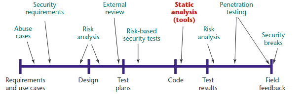
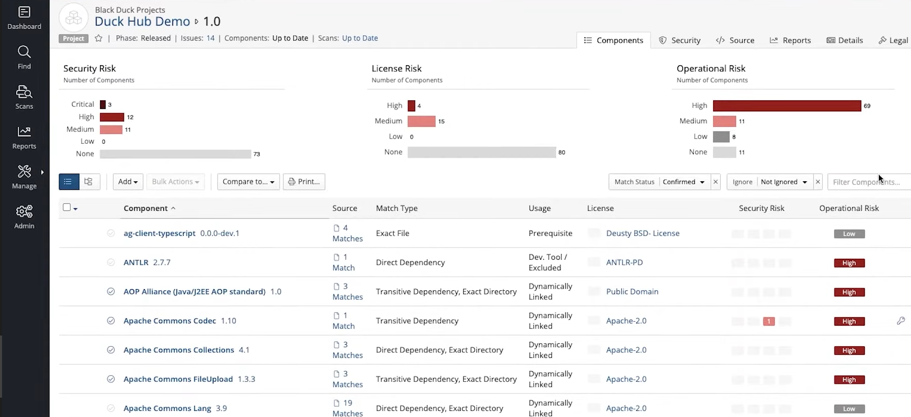

# Vulnerabilities

A vulnerability is an intentional or unintentional, exploitable weakness in the software. When discovered, it is usually reported back to the community for fixes, and to vulnerability databases for awareness. A preferred consumption behavior is to contribute/report any detected weaknesses. The responsibility to be aware of the security status of a software program, and to update the affected software, lies with the open-source consumer, whenever a patch or update is made available by the developing open-source community.

### _Outline_ 📋
In this chapter, we learn about
- Checking the vulnerability [status](#status) of an open source component
  - Using [Static Analysis](#static-analysis)
  - Using [Binary Analysis](#binary-analysis)
- [Identifying](#identification) the vulnerabilities
- [Monitoring](#monitoring) for vulnerabilities
- Quantifying the [impact](#impact) of vulnerabilities
- [Managing](#management) vulnerabilities effectively

We also encourage you to explore the links throughout the text, and the [Do-It-Yourself](#diy) tasks.

## Status

Checking for vulnerabilities in an open-source software program, or dependency, can be done by scanning well-known vulnerability databases, such as Common Vulnerabilities and Exposures, or [CVE](https://cve.mitre.org/), or the National Vulnerability Database, or [NVD](https://nvd.nist.gov/), provided by the National Institute of Standards and Technology ([NIST](https://www.nist.gov/)). Commercial tool providers like [synopsys](https://www.synopsys.com/), [MEND](https://www.mend.io/), [synk](https://snyk.io/), and others also provide vulnerability status, and are often trusted reporters to the vulnerability databases.

### Static Analysis

Securing code repositories and any access to them does not guarantee that the code itself is free of vulnerabilities. Vulnerabilities in code may be detected statically, and subsequently fixed. On the contrary, if they are allowed to propagate through the supply chain, they can pose a risk downstream.

The following image illustrates the stage of the programming proccess at which this type of analysis may be used

<!--  | 
*Image source: https://www.technologyies.com/what-is-pki-infrastructure-and-how-does-it-work/* |  -->

 |
*Image source: Chess, Brian, and Gary McGraw. "Static analysis for security." IEEE security & privacy 2.6 (2004): 76-79* |

Static analysis does not aim to eliminate all the security problems; it aims to make the code 'good enough'. It achieves this by utilizing rules and patterns to detect unsafe operations (e.g., *gets(&buf)* ) without actually running the code in question. There are several ways to perform this analysis, from simple to more advanced and accurate ones:

- A simple solution is the use of the Unix `grep` command in order to find lines of code that can be problematic
- Basic lexical analysis tools (e.g., [Flawfinder](https://dwheeler.com/flawfinder/)) can tokenize source files and match them against already-known vulnerabilities
- There are tools that take into account the semantics of the language, e.g., the relationships between the functions and the classes ([list of tools](https://www.nist.gov/itl/ssd/software-quality-group/source-code-security-analyzers)). Such tools usually require the developer to define safety properties, expected function behavior, and unsafe operations (e.g., global variable modification)

### Binary Analysis

Vulnerable or malicious code can be inserted in various stages of the supply chain, potentially circumventing some of the implemented security checks. Contrary to the previous methodology, binary analysis acts directly on the compiled program, the executable; which includes the whole suite of libraries and code needed for the software to run. It is possible, for example, for a compromised compiler to introduce malicious code into the executable without any modification to the source code.
Binary analysis can tackle such problems. Tools like [angr](https://angr.io/) can produce control flow graphs from the executable, making it easier to detect bugs and unintended behavior. Others tools, such as [Black Duck](https://www.synopsys.com/software-integrity/security-testing/software-composition-analysis/binary-analysis.html), can detect outdated libraries, previously-known vulnerabilities, unwanted leakage of tokens and personal information (e.g., hardcoded email addresses). A security analysis of a binary is illustrated below:

 |
*Image source: https://www.synopsys.com/software-integrity/engage/sca* |

Binary analysis can also tackle the problem of compromised compilers. For example, the resulting executable from a supply chain can be compared with an executable produced in a safe and "trusted" environment, to ensure **software integrity**. Differences between the two executables could be caused due to the insertion of malicious code.

## Identification

When looking up the vulnerability status of an open-source software package in a vulnerability database, it is vital to check for the correct component. Techniques for assisting this identification do exist, but unfortunately, there is no uniform or standardized way of doing so. Efforts like the Common Platform Enumeration ([CPE](https://nvd.nist.gov/products/cpe)) by NIST, or the Universally Unique Identifier (UUID) by Open Software Foundation (OSF) both have their pros and cons, and none is without the risk of misidentification, even if used together.

## Monitoring

Vulnerability monitoring should ideally be performed both during development, as well as after development. This is done so as to swiftly be able to take mitigative actions. Regular monitoring of the vulnerability status of all components in the supply chain may be performed manually or automatically, with the help of commercial or open-source tools, that are synchronized with vulnerability database(s).

## Impact

The analysis of the possible impact of vulnerability exposures should be performed upon discovery of a reported and included in the supply chain of a software project. Depending on the result of this analysis, it should be possible to understand if and how the vulnerability may be exploited by malicious actors. The vulnerability should be promptly managed, in the exposed installations.

## Management

The Common Vulnerability Scoring System, or [CVSS](https://www.first.org/cvss/), is a method used to supply a qualitative measure of the severity of a vulnerability. CVSS is not a measure of risk. CVSS consists of three metric groups: Base, Temporal, and Environmental. The Base metrics produce a score ranging from 0 to 10, which can then be modified by scoring the Temporal and Environmental metrics. Depending on the vulnerability severity, CVSS scoring, support context, community status, and the impact on the software project, developers can consider remediation paths, such as:
- Temporary own fix with or without feedback to the community
- Wait for the next version by the community
- Back-porting of project to an older version
- Relying on the supplier for a patch or correction
An important aspect of vulnerability management should also be to update the database of the organization to include the detected status, to avoid future selection and use of the component.

## DIY

### _Novice_ 👾
- Vulnerability analysis needs to happen only once?
- Static and binary analysis is enough to capture all vulnerabilities?
- Who is responsible for checking the correctness of updates?

### _Expert_ 💯

## References

1. [Static analysis for security. Brian Chess, Gary McGraw](https://ieeexplore.ieee.org/stamp/stamp.jsp?arnumber=1366126)
2. [Countering trusting trust through diverse double-compiling. David A. Wheeler, 2005.](https://ieeexplore.ieee.org/document/1565233)
3. [Common Vulnerabilities and Exposures](https://cve.mitre.org/)
4. [NIST Executive Order 14028](https://www.nist.gov/itl/executive-order-14028-improving-nations-cybersecurity/software-security-supply-chains)
5. [NIST list of code analyzers](https://www.nist.gov/itl/ssd/software-quality-group/source-code-security-analyzers)
6. [Common Platform Enumeration dictionary](https://nvd.nist.gov/products/cpe)
7. [The Common Vulnerability Scanning System](https://www.first.org/cvss/)