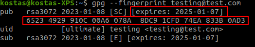
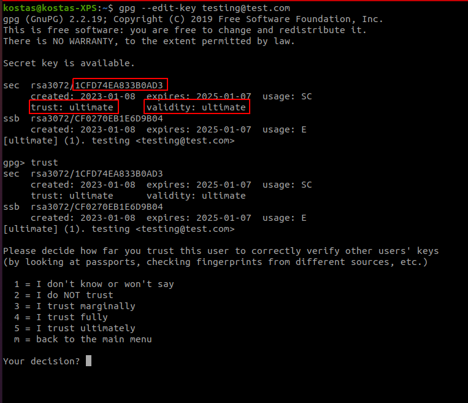

# Web of Trust

### _Outline_ 📋
In this chapter, we learn about
- What is the [Web of Trust](#web-of-trust)
- What are the [Basic Differences to PKI](#basic-differences-to-pki)
  - [Keys Distribution](#key-distribution)
  - [Trust Levels](#trust-levels) in the Web of Trust
  - How do we [Revoke Keys](#key-revocation)
- How can we [Enter the World of Trust using GPG](#entering-the-world-of-trust-using-gpg)
  
We also encourage you to explore the links throughout the text, the [Do-It-Yourself](#diy) tasks, as well as the resources listed in the [references](#references).

## Web of Trust

In the previous section, we utilized the PKI to bind public keys to a physical entity. However, PKI is not the only option; attesting code and infrastructure can be done in another way. Following the same procedure as before: a user can distribute their public key and sign their code/work with a private key. The public key can then be used to verify that the code was submitted by the user, through their corresponding private key. The alternative to PKI, is the web of trust. The web of trust is a *decentralized* model that allows each user to endorse the association between a public key and a person; this way indirect trust can be achieved. The following image illustrates this:

 |
*Image source: https://en.wikipedia.org/wiki/Web_of_trust* |

## Basic differences to PKI

Instead of requiring a central authority to sign the user's `public` key (thus creating the certificate), the users take up the role of the Certificate Authority (CA). Because, several endorsements for a specific key needs to happen for it to be trusted (for openPGP-compliant implementations), web of trust avoids the single point of failure that exists in the PKI system; compromising a single CA would allow for the creation of trusted keys in the whole domain under this CA (including other CAs). On the other hand, it may be difficult for new users to find endorsements for their (self-signed) certificates and ultimately be able to comminicate, e.g., because they cannot physically meat other users.

### Key Distribution
Public keys can either be downloaded from the internet or shared between users. Users who know each other can share their credentials on their own without the need for external services. Key signing parties, where individuals can share their public keys are also another way of distributing and gathering new keys, e.g., in meetings like the [Free and Open Software Developers' European Meeting (FOSDEM)](https://en.wikipedia.org/wiki/FOSDEM). To facilitate other means of distributing keys, several key servers, e.g., [keys.openpgp.org](https://en.wikipedia.org/wiki/FOSDEM) or [MIT PGP Key Server](https://pgp.mit.edu/), exist that allow the download and the import of keys in a local keyring, i.e., the credentials storage. This way, a user can start building his network of trusted devices; in the same way, he can export and upload his key. 

### Trust Levels
However, importing keys should not happen without checking for its fingerprint and/or validating from whom it came from. Moreover, a key can be "valid", i.e., it definetely belongs to that user, but it also has the notion of "trust", i.e., we trust that this person correctly verifies other peoples' keys. To answer the problem of trust, in the openPGP ecosystem, a voting scheme is used to determine the trust of a key - user association. The voticing scheme is optional and user-parameterized; for example, a user can select to trust an association with three partially accepted endorsments and with one fully trusted.

Partial trust is confered when we marginally trust a user, e.g., when we have less than three partially accepted endorsments. Fully trusted, on the other hand, is implied when the association is endorsed by other fully-trusted users or several other partially-trusted ones depending on the configuration used. 

### Key Revocation
The problem of compromised keys remains the same even when using a Web of Trust for trusting other users. In this case, there is no centralized authority that distributes a revocation list for the user to revoke a certificate. In order to revoke a key, the user needs to manually generate a revocation certificate for his key; import it into his own keyring; and then upload it or share it to other parties. The relevant parties must then update their own keyrings in order for the key to be revoked. However, uploading the revoked key into a key server does not guarantee that a remote user will get this update - the procedure is manual.

## Entering the world of trust using GPG

Our keys need to be trusted by other entities in the web of trust; a task not trivial or without pitfalls. After we have generated a key (`gpg --gen-key`), we need to start distributing our key to remote parties.
- We can see all the keys in our keyring by running: `gpg --list-keys`.
- To export a key, gpg allows to do `gpg --export <id>`; when we want to email this key we can also add the option `--armor` to output the key in ASCII-armored format.
- When we receive a `public` key from someone else, we need to perform a few actions:
  - `gpg --fingerprint <key>` will give us all the information for the provided key - the fingerprints should match!
  - `gpg --import <key>` will import a key into our keyring

  

- So far, we have signed any key in our keyring. When we want to endorse a key because we know it comes from a specific person we execute: `gpg --lsign-key <key>`. 
- In case we want to check the signature of a key we can perform: `gpg --check-sig <key>`. This command gives us some very usefull insights:
  - We can see the number of endorsments the key has!
  - We can see in the form of `!` or `-` if the key is verified or not respectively
- In order to confer trust, we need to edit the key:
  - `gpg --edit-key <ourkey>` opens an interactive gpg session for the given key. In the picture we can see the keyID, the trust (ultimate, because we created it!) on the key and its validity!
  - `gpg> trust` command will allows us to specify the trust for this user/key
  
  

- If our key gets compromised, we need to revoke it to make sure noone can sign documents/data in our name; the following commands achieve this:
  - `gpg --output revoke.asc --gen-revoke <ourKeyID>` creates a revocation certificate
  - `gpg --import revoke.asc` will actually revoke our key in the keyring
  - `gpg --keyserver <keyserver> --send-keys <ourKeyID>` will revoke the key in the key server

## DIY

### _Novice_ 👾
- Generate a key pair and send your `public` key to a friend - or create two pairs in the same machine
- Import a key to your keyring
- Why do we need to check the fingerprint of a key before importing it?
- What happens when we endorse a key? How does this operation confers trust?
- How many endorsements are needed for a key to be fully trusted?

### _Expert_ 💯
- Should we accept a key by only ckecking the 32-bit ID?
- What inevitable drawback emerges when we have keys with multiple endorsements?
- Are old emails safe from an attacker who possess a leaked key?
- Revoke the key generated in the previous questions; can you send a message to your friend using this key?

## References
1. What is the [Web of Trust?](https://en.wikipedia.org/wiki/Web_of_trust)
2. [GPG documentation](https://www.gnupg.org/documentation/)
3. [Core concepts in PGP](https://www.linux.com/training-tutorials/pgp-web-trust-core-concepts-behind-trusted-communication/)