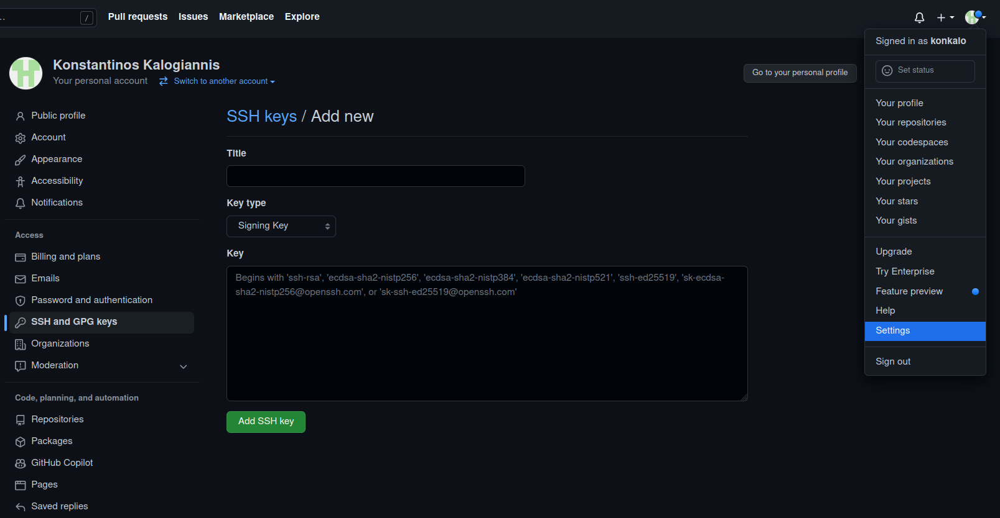
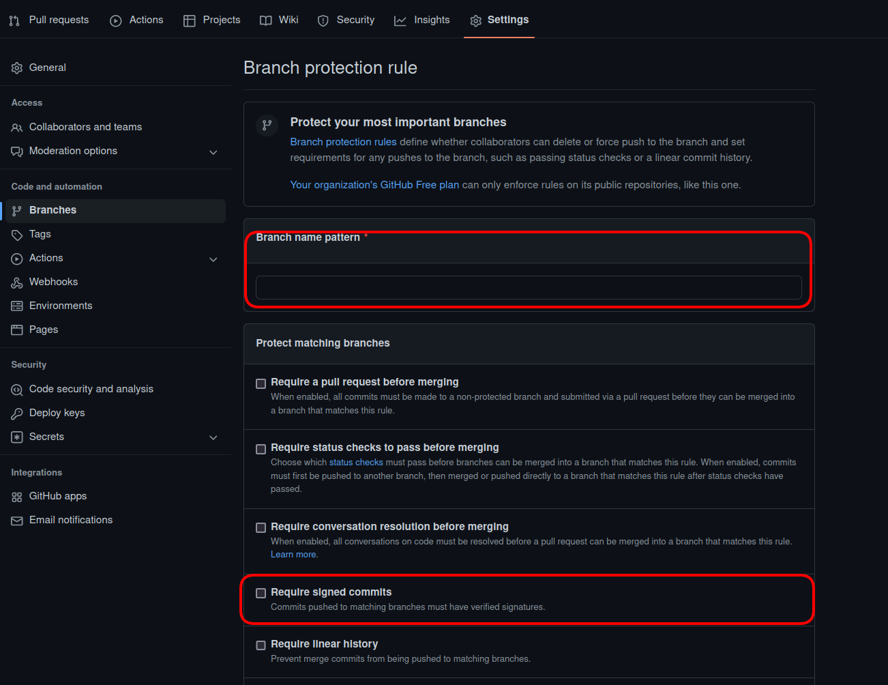

# Security in code infrastructure

### _Outline_ 📋
In this chapter, we learn about
- The basics of [credential management](#credential-management)
  - The [Public Key Infrastructure](#public-key-infrastructure)
  - [Public Key Encryption](#public-key-encryption)
  - The [Web of Trust](#web-of-trust)
  - [Handling credentials](#credential-handling)
- Two-factor Authentication, or [2FA](#access-control-and-2fa), for Git repositories
- [Signing](#signing-commits) commits
- [verifying](#verifying-commits) commits
- Establishing [branch protection rules](#branch-protection-rules)
- The fundamentals of [static](#static-analysis) and [binary](#binary-analysis) security analysis

We also encourage you to explore the links throughout the text, the [Do-It-Yourself](#diy) tasks, as well as the resources listed in the [references](#references).

## Credential Management

### Public Key Infrastructure

Before delving into the finer details of securing the code infrastructure, we need to first discuss one of the basic components of access control and code attestation. The Public Key Infrastructure, or [PKI](https://en.wikipedia.org/wiki/Public_key_infrastructure), is a set of entities, with distinct roles, responsible for managing digital certificates. This includes their generation, storage, distribution, and revocation. These certificates can then be used to authenticate a user, or a machine, to a service.

The following is a simple illustration of the role of the PKI. The goal is to tie the keys used to encrypt the transmitted data to the sender and the receiver.

 | 
*Image source: https://www.technologyies.com/what-is-pki-infrastructure-and-how-does-it-work/* | 

 <!--  -->

The PKI ensures that the `public` keys used to communicate with a server, a company, or an individual, belong to the actual owner. As long as the certificate authority is trusted, a user can be sure that the communication happens with the intended recipient.

To bring it to the context of supply chains: The PKI helps ensure that the downloaded software was produced by a specific entity; it can also ensure that the code has not been changed during the lifetime of the supply chain (if signing/verification happens at each step). Moreover, the PKI can also be used to trace published code to a specific individual. We can see in the following picture the need for an infrastructure that takes care of authentication. In the real world, the driver would provide an ID to the factory and the store. In the software supply chain, this is accomplished with the use of credentials.

  |
 *Image source: https://www.docker.com/blog/* |

### Public Key Encryption

The PKI also facilitates the use of assymetric encryption, known also as public key encryption (PKE). In this scheme, each user has two distinct keys; one is `public`, while the other must always remain `private`. The public key can be freely distributed to the world and is required to `verify` that a piece of software was `signed` (or encrypted) by the corresponding private key. This highlights the importance of keeping the private key secure; leaking this key would allow anyone to impersonate its actual holder.

In the context of code infrastructure security, a compromised `private` key would allow anyone to `push` to a specific branch, `sign` the code such that it appears to originate from someone else, such as [Linus Torvalds](https://github.com/torvalds), and ultimately introduce malicious code into the supply chain.

### Web of Trust

PKI is not necessarily needed for attesting code and infrastructure. A user can distribute their public key and sign their code/work with a private key. The public key can then be used to verify that the code was submitted by the user, through their corresponding private key. This, however, does not link the public key with an individual; when PKI is not used, the alternative is to create a web of trust. The web of trust is a decentralized model, allowing each user to endorse the association between a public key and a person; this way indirect trust can be achieved. The following image illustrates this:

 |
*Image source: https://en.wikipedia.org/wiki/Web_of_trust* |

### Credential handling

Due to its nature, improper handling of credentials can lead to serious damage, especially since credentials ensure the security and integrity of a supply chain. The following steps are recommended for propoer management of credentials:
- Private keys must always remain secret
- When possible, two-factor authentication, or 2FA, should be used
- Keys and credentials should be changed in periodically, and should not be permanent
- Certificates should have an expiration date
- Keys should be used for one protocol only; this prevents cross-protocol attacks, e.g., [SSL attack](https://www.controlcase.com/cross-protocol-attack-on-tls-using-sslv2-drown-vulnerability-cve-2016-0800-mar-2016/))

## Access control and 2FA

Git is an excellent tool for source-code management. However, it does not provide access control by default. A repository may have private or public visibility, but it does not implement any authentication on its own. Access control is done to ensure that only assigned developers can read and write to it. Some [examples](https://wincent.com/wiki/Git_repository_access_control) of this include the use of `git-daemon` to provide read-only (anonymous) access, or the requirement of using SSH keys to `push` code into the repository. Users without the appropriate SSH key do not have `push` access to the repository.

Moreover, a simple step for improving the security of a repository further is to introduce Two-Factor Authentication (2FA) when logging in to a Git account. 2FA effectively requires the user to present two pieces of information to authenticate themselves (e.g., knowledge, through a password, and possession, through a phone that receives a one-time password). This raises the difficulty of compromising an account and gaining access to critical code. GitHub provides a detailed guide on how to [configure 2FA](https://docs.github.com/en/authentication/securing-your-account-with-two-factor-authentication-2fa/configuring-two-factor-authentication), or [recover](https://docs.github.com/en/authentication/securing-your-account-with-two-factor-authentication-2fa/configuring-two-factor-authentication-recovery-methods) an account. Accessing the account can be [straightforward](https://docs.github.com/en/authentication/securing-your-account-with-two-factor-authentication-2fa/accessing-github-using-two-factor-authentication) through the web, or through the command line using [SSH](https://docs.github.com/en/authentication/keeping-your-account-and-data-secure/about-authentication-to-github).

## Signing commits

Another useful service that Git allows through the use of `SSH` keys is the possibility to `sign` code that is `pushed` to a repository. This ensures that all commits are authenticated, and the developer responsible for the code can be attributed.
In order for a commit to be signed, the `public` key must be added to the user's account; the procedure is similar to adding a key for authenticating to GitHub.




The following lines enable code signing from the command line ([instructions](https://docs.github.com/en/authentication/managing-commit-signature-verification/telling-git-about-your-signing-key)), assuming that `SSH` keys have already been created, e.g., for accessing the repository ([SSH key generation](https://docs.github.com/en/authentication/connecting-to-github-with-ssh/generating-a-new-ssh-key-and-adding-it-to-the-ssh-agent), [SSH access](https://docs.github.com/en/authentication/connecting-to-github-with-ssh/adding-a-new-ssh-key-to-your-github-account)).

```
git config commit.gpgsign true
git config gpg.format ssh //when using SSH key instead of GPG
git config user.signingkey "public_key"
```

More information on the proccess of signing commits can be found in the [signing commits](https://docs.github.com/en/authentication/managing-commit-signature-verification/signing-commits) section on GitHub.

## Verifying commits

There are two ways to verify that a commit was signed with a valid key. The most straightfoward option is to visually inspect if the commit has a `Verified` icon next to it in the web interface as shown below.


For a command-line option, Git needs to be configured in order to check against the provided public keys. The file must contain at least one principal (e.g., user1@example.com), followed by the associated public key in a single line. The following commands show the steps required to achieve this.

```
git config gpg.ssh.allowedSignersFile <file>
git verify-commit -v <commit>
```

## Branch protection rules

Apart from restricting access to the code base, GitHub also provides protection rules that can be applied in order to restrict possible actions by unauthorized users, such as pull requests or merges. For example, GitHub allows repository administrators to require pull requests for all branches that contain the word *release* in their name; or, that pull requests that affect other developers' code must be first approved by the code owner.

The relevant interface is shown below. More information about this proccess can be found in  [branch protection rules](https://docs.github.com/en/repositories/configuring-branches-and-merges-in-your-repository/defining-the-mergeability-of-pull-requests/managing-a-branch-protection-rule).




## Static analysis

Securing code repositories and any access to them does not guarantee that the code itself is free of vulnerabilities. Vulnerabilities in code may be detected statically, and subsequently fixed. On the contrary, if they are allowed to propagate through the supply chain, they can pose a risk downstream.

The following image illustrates the stage of the programming proccess at which this type of analysis may be used

<!--  | 
*Image source: https://www.technologyies.com/what-is-pki-infrastructure-and-how-does-it-work/* |  -->


 |
*Image source: Chess, Brian, and Gary McGraw. "Static analysis for security." IEEE security & privacy 2.6 (2004): 76-79* |

Static analysis does not aim to eliminate all the security problems; it aims to make the code 'good enough'. It achieves this by utilizing rules and patterns to detect unsafe operations (e.g., *gets(&buf)* ) without actually running the code in question. There are several ways to perform this analysis, from simple to more advanced and accurate ones:

- A simple solution is the use of the Unix `grep` command in order to find lines of code that can be problematic
- Basic lexical analysis tools (e.g., [Flawfinder](https://dwheeler.com/flawfinder/)) can tokenize source files and match them against already-known vulnerabilities
- There are tools that take into account the semantics of the language, e.g., the relationships between the functions and the classes ([list of tools](https://www.nist.gov/itl/ssd/software-quality-group/source-code-security-analyzers)). Such tools usually require the developer to define safety properties, expected function behavior, and unsafe operations (e.g., global variable modification)

## Binary analysis

Vulnerable or malicious code can be inserted in various stages of the supply chain, potentially circumventing some of the implemented security checks. Contrary to the previous methodology, binary analysis acts directly on the compiled program, the executable; which includes the whole suite of libraries and code needed for the software to run. It is possible, for example, for a compromised compiler to introduce malicious code into the executable without any modification to the source code.
Binary analysis can tackle such problems. Tools like [angr](https://angr.io/) can produce control flow graphs from the executable, making it easier to detect bugs and unintended behavior. Others tools, such as [Black Duck](https://www.synopsys.com/software-integrity/security-testing/software-composition-analysis/binary-analysis.html), can detect outdated libraries, previously-known vulnerabilities, unwanted leakage of tokens and personal information (e.g., hardcoded email addresses). A security analysis of a binary is illustrated below:

 |
*Image source: https://www.synopsys.com/software-integrity/engage/sca* |

Binary analysis can also tackle the problem of compromised compilers. For example, the resulting executable from a supply chain can be compared with an executable produced in a safe and "trusted" environment, to ensure **software integrity**. Differences between the two executables could be caused due to the insertion of malicious code.


## DIY

### _Novice_ 👾
- Create a new GitHub repository
- Perform the following functions: clone, commit, merge, push, pull request
- Create access `SSH` keys and assign them to your GitHub account
- Create signing `SSH` or `gpg` keys and attach them to your GitHub account
- Sign a commit

### _Expert_ 💯
- Configure branch rules for your repository on GitHub to restrict access
- Set up and enable 2FA functionality in your GitHub account

<!-- ## Industry Use Cases
    The following lists outline the general knowledge that a user should have from a security perspective.
## Test Questions / Areas / Learning Goal
- Understand the difference between using HTTPS and SSH for accessing the repository
- Understand how to store and manage credentials
- What problems can static and binary analysis solve
- Has the capability to argue about properties of the cryptographic keys, e.g., the size and the cipher used
- Understands the implications and potential vulnerabilities that emerge from the choice of key properties, and storage, and 2FA options
- What type of analysis to use and when
- What guarantees does static and binary analysis provide
-->

## References

1. [Static analysis for security. Brian Chess, Gary McGraw](https://ieeexplore.ieee.org/stamp/stamp.jsp?arnumber=1366126)
2. [Countering trusting trust through diverse double-compiling. David A. Wheeler, 2005.](https://ieeexplore.ieee.org/document/1565233)
3. [Github docs](https://docs.github.com/en)
4. [How PKI works](https://www.thesslstore.com/blog/how-pki-works/)
5. [What is PKI](https://www.technologyies.com/what-is-pki-infrastructure-and-how-does-it-work/)
6. [Git access control examples](https://wincent.com/wiki/Git_repository_access_control)
7. [NIST Executive Order 14028](https://www.nist.gov/itl/executive-order-14028-improving-nations-cybersecurity/software-security-supply-chains)
8. [NIST list of code analyzers](https://www.nist.gov/itl/ssd/software-quality-group/source-code-security-analyzers)


<!-- [hide email](https://stackoverflow.com/questions/43863522/error-your-push-would-publish-a-private-email-address) -->
<!-- (KK, PP)
     - open question: different users with different repos - 
        - is there a connection? 
        - can I convince you? 
        - What infrastructure is needed? 
        - What if I loose the keys? Someone has my password and introduces his own keys?
     -(KK,PP)

-->