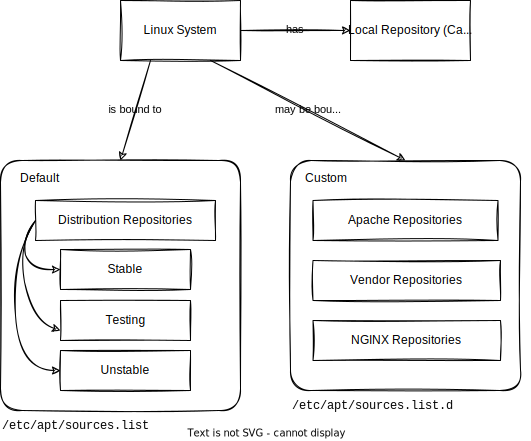
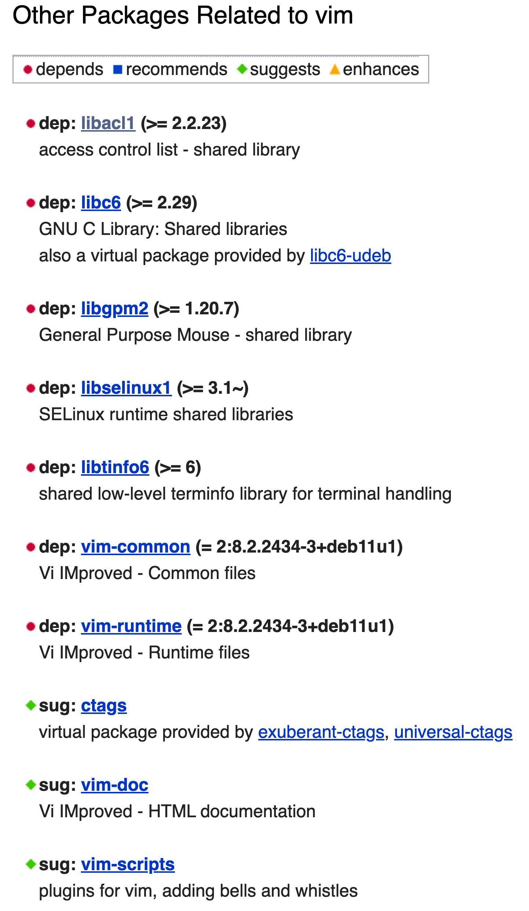
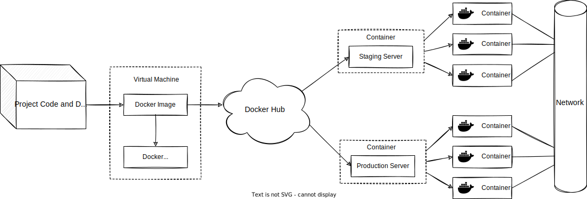
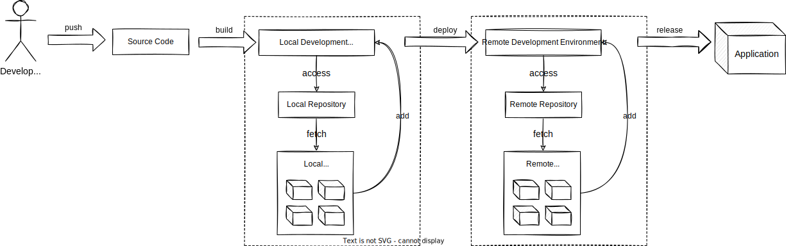

# Package Managers

[Package managers](https://en.wikipedia.org/wiki/Package_manager) are software tools that allow handling software dependencies in a consistent manner. Most package managers are used to automate the process of installing, upgrading, configuring, and removing third-party [software dependencies](https://en.wikipedia.org/wiki/Third-party_software_component). They also provide a consistent interface for installing software across different [operating systems](https://en.wikipedia.org/wiki/Operating_system) and distributions. Package managers can be divided, according to their scope, into three categories: system-level, deployment-level, and development-level. This chapter describes the role of package managers in software development and discusses their impact on [software ecosystems](https://en.wikipedia.org/wiki/Software_ecosystem).

### _Outline_ 📋

In this chapter, we learn about:
 
- The principal characteristics of [system-level package managers](#system-level-package-managers), [deployment-level package managers](#deployment-level-package-managers), and [development-level package managers](#development-level-package-managers) 
- The role of [software dependencies](#software-dependencies) in software development, and how package managers handle them
- The impact of [software ecosystems](#software-ecosystems) in modern software development
- [Use cases](#industry-use-cases) for open-source software in the industry

We also encourage you to explore the links throughout the text, the [Do-It-Yourself](#diy) tasks, as well as the resources listed in the [references](#references).

## System-level Package Managers

System-level package managers are used to install software on the operating system, which is the primary software system that runs on a computer. There are many software programs that are not shipped by default with an operating system, but are required for the operating system to perform specific tasks. For instance, [asciiart](https://packages.ubuntu.com/jammy/misc/asciiart), a tool that converts images into [ASCII art](https://www.asciiart.eu/), is not included with a standard installation of [Ubuntu](https://en.wikipedia.org/wiki/Ubuntu), a Debian-based Linux distribution. However, it can be installed using the [APT](https://en.wikipedia.org/wiki/APT_(software)) package manager. APT is a command line tool responsible for downloading, installing, updating, and removing packages from the local system by communicating with online repositories.

APT facilitates the installation a plethora of useful software packages. For example, the [Vim editor](https://en.wikipedia.org/wiki/Vim_(text_editor)) can be installed by running the following command on the [terminal](https://en.wikipedia.org/wiki/Terminal_emulator):

```bash
$ sudo apt install vim
```

To understand how the APT package manager [works](https://devconnected.com/apt-package-manager-on-linux-explained/), it is useful to understand the Linux packaging system. The following figure illustrates a typical Linux system configured to fetch software from three different repositories: 



The _default_ official repository in the figure denotes the remote registry that contains third-party packages that are available for installation, such as the Debian packages [repository](https://packages.debian.org/stable/editors/vim) for the Vim editor. The APT _cache_ provides offline information about the packages currently installed on the local system. It guarantees that the user is able to access package information without having to connect to the Internet.

{:height="50%" width="50%"}

As can be seen from the figure, system-level package managers also include metadata for each package. This metadata includes the functionalities provided by the package, information about its developers, and perhaps most importantly, the list of other packages it depends on, i.e., its **dependencies**. For example, the Vim editor depends on the [libacl1](https://packages.debian.org/bullseye/libacl1) package. We will learn more about dependencies in the next section.

Below is a list with some of the most popular package managers for different operating systems:

| Package Manager                                                                                             | Description                                                                  |
|-------------------------------------------------------------------------------------------------------------|------------------------------------------------------------------------------|
| [apt](https://wiki.debian.org/Apt)                                                                          | The package manager for Debian, Ubuntu, and other free Linux distributions   |
| [yum](https://en.wikipedia.org/wiki/Yum_(software)) and [dnf](https://en.wikipedia.org/wiki/DNF_(software)) | The package manager for Fedora and Red Hat Enterprise Linux distributions    |
| [Mac App Store](https://en.wikipedia.org/wiki/Mac_App_Store)                                                | The official package manager for macOS applications                          |
| [Google Play](https://en.wikipedia.org/wiki/Google_Play)                                                    | The official package manager for Android applications                        |
| [Windows Package Manager](https://en.wikipedia.org/wiki/Windows_Package_Manager)                            | The official package manager for Windows                                     |

## Deployment-level Package Managers

Deployment-level package managers are used to handle [container images](https://opensource.com/article/21/8/container-image) and application dependencies. They are used to install software that is required for an application to function in a standalone manner, without any dependence on the operative system, solving the _"But it works on my machine!"_ problem. For example, the [Docker](https://en.wikipedia.org/wiki/Docker_(software)) package manager is used to install and run software, called _images_, in an isolated, containerized environment. [Docker Hub](https://hub.docker.com/), which can be likened to a Git repository for Docker images, is a cloud-based repository that allows users to create, manage, and store these images. Docker provides an interface to communicate with Docker Hub and deploy images there, in public or private repositories. For example, we can create a Dockerfile, build a Docker image, and upload it to our account on Docker Hub, by executing the following commands on the terminal:

```bash
# Create a Dockerfile
$ echo "FROM ubuntu:latest" > Dockerfile

# Build a Docker image
$ docker build -t my_image .

# Upload the image to Docker Hub
$ docker push my_image
```  

The following figure illustrates how the Docker packaging system operates on a network.



Organizations maintain [public and official](https://hub.docker.com/search?q=) Docker images in their Docker Hub repository. A Docker image that is available on Docker Hub can be reused within other applications, and spin up new containers. Individual containers can communicate with each other over a [network](https://www.edureka.co/blog/docker-networking/) to perform the required actions as applications execute.

The following table presents some popular online repositories for container images.

| Package Manager                                                                                                                              | Description                                                                                                                                                                     |
|----------------------------------------------------------------------------------------------------------------------------------------------|---------------------------------------------------------------------------------------------------------------------------------------------------------------------------------|
| [Docker Hub](https://hub.docker.com/)                                                                                                        | Docker Hub is the world's largest library and community for container images                                                                                                    |
| [Docker Registry](https://docs.docker.com/registry/)                                                                                         | The Registry is a stateless, highly scalable server side application that stores and lets you distribute Docker images                                                         |
| [Quay](https://quay.io/)                                                                                                                     | Quay is a package manager from RedHat that builds, analyzes, and distributes container images                                                                                   |
| [GitHub Container Registry](https://docs.github.com/en/packages/working-with-a-github-packages-registry/working-with-the-container-registry) | A package manager from GitHub that that allows to store and manage Docker and OCI images in the Container registry, which uses the package namespace [ghcr.io](https://ghcr.io) |

## Development-level Package Managers

Development-level package managers run on top of the operative system and container images. They operate on top of the programming languages and tools that developers use to build software applications. In contrast with the system- and deployment-level package managers, development-level package managers focus on smaller parts of the software system, such as a programming language or a framework. They are used to manage the co-development of code and documentation for a collection of functions or routines with a common theme. The output is, thereby, a package with software functions that typically will not be complete and usable in a standalone fashion. For example, most modern applications need to work with [JSON](https://en.wikipedia.org/wiki/JSON) data. A development-level package manager, such as [Maven](https://maven.apache.org/) or [Gradle](https://gradle.org/) for Java, [pip](https://pypi.org/project/pip/) for Python, or [npm](https://www.npmjs.com/) for JavaScript, allows developers to integrate pre-existing JSON parsing libraries within their application, without having to implement their own. A good application-level package development process helps developers conform to good documentation and coding practices, integrating some level of [unit testing](https://en.wikipedia.org/wiki/Unit_testing).

> Development-level packages are essentially one of two things: a [library](https://en.wikipedia.org/wiki/Library_(computing)) or an [application](https://en.wikipedia.org/wiki/Application_software).

The following figure illustrates the typical use of a package managers to build a software project:



There are two key elements in the above figure:
1. The software project: a project that uses the package manager to manage its dependencies
2. The local repository: a cache of the package manager maintained locally on the system
3. The remote repository: a remote address on the Internet where packages and dependencies are hosted

For example, this chapter is written in [Markdown](https://en.wikipedia.org/wiki/Markdown) and uses the [Rubygems](https://rubygems.org/) package manager to handle the dependencies required to build this website. In particular, [Kramdown](https://rubygems.org/gems/kramdown) is the Ruby dependency in charge of converting Markdown into the [HTML](https://en.wikipedia.org/wiki/HTML) that our web browsers understand. Here is an excerpt of the [Gemfile](./Gemfile) that is used every time this website is built:

```ruby
source "https://rubygems.org"
gem "minima", "~> 2.5"
gem "webrick", "~> 1.7"
gem 'kramdown', '~> 2.3', '>= 2.3.1'
...
```

Development-level package managers are designed to be immutable. There are rules to prevent the removal of packages from remote repositories, and ensure that dependencies are not changed once they are deployed [^1]. This prevents developers of software packages from arbitrarily removing them from the ecosystem, which could otherwise increase the risk of breaking (transitive) dependent projects. If a dependency has new features, or is found to have a bug, a new version of the dependency is released. The immutable nature of package managers is a key feature that allows for [reproducible builds](https://reproducible-builds.org/).

> A famous example of the problem with mutable package managers is the [left-pad incident](https://www.theregister.com/2016/03/23/npm_left_pad_chaos/) that occurred with the [npm](https://www.npmjs.com/) package manager. Despite its small size (just a few lines of source code), the sudden and unexpected removal of the `left-pad` package caused thousands of direct and indirect dependent projects to break, including very popular ones such as [atom](https://www.npmjs.com/package/atom) and [babel](https://www.npmjs.com/package/@babel/core).

Below is a list with a few of the official package managers for some of the most popular programming languages:

| Package Manager                      | Description                                                                                                                                                                                                       |
|--------------------------------------|-------------------------------------------------------------------------------------------------------------------------------------------------------------------------------------------------------------------|
| [Pip](https://pypi.org/)             | The Python Package Index (PyPI) is a repository of software for the Python programming language                                                                                                                  |
| [Maven](https://search.maven.org/)   | The missing package manager for macOS (or Linux)                                                                                                                                                                 |
| [CRAN](https://cran.r-project.org/)  | Yum is a free and open-source command-line package-management utility for computers running Linux operating systems using the RPM Package Manager                                                                |
| [RubyGems](https://rubygems.org/)    | The RubyGems package manager is a collection of software development tools that helps you build, install, and manage Ruby applications and libraries                                                             |
| [NuGet](https://www.nuget.org/)      | NuGet is the package manager for .NET. The NuGet client tools provide the ability to produce and consume packages. The NuGet Gallery is the central package repository used by all package authors and consumers |
 | [Cargo](https://crates.io/)          | Cargo is the Rust package manager                                                                                                                                                                                |
 | [Composer](https://getcomposer.org/) | Dependency Manager for PHP                                                                                                                                                                                       |

## Software Repositories

[Software repositories](https://en.wikipedia.org/wiki/Software_repository) are storage locations for software packages. Package managers interact with software repositories in order to build software projects by querying the repositories with the goal of retrieving packages from them.

There are two types of software repositories:
1. Local repositories: repositories that are located on the local filesystem
2. Remote repositories: repositories that are located on a remote server

Public repositories are used in order to aggregate free software provided by the community. For example, on Linux, software is distributed through public repositories that are tied to a specific distribution (e.g., Ubuntu, Debian, CentOS, or RHEL have their own repositories that are updated daily). Additionally. trusted repositories can also be configured on the local system, so that packages can be installed from them.

## Software Ecosystems

Software ecosystems are large collections of interdependent software components, including package managers, that are maintained by large and geographically distributed communities of collaborating contributors [^2]. Typical examples of open-source software ecosystems are distributions for Linux operating systems, and packaging ecosystems for specific programming languages. Each package manager has its own policies related to package updates or package dependencies. While packaging ecosystems are extremely useful for their respective communities of developers, they face challenges related to their scale, complexity, and rate of evolution. Typical problems are backward incompatible package updates, and the risk of (transitively) depending on packages that have become obsolete or inactive. Assessing the quality of package dependency networks, and supporting it through proper dependency management tools, better policies, and ecosystem health analysis dashboards is of utmost importance.

For this purpose, the __Software Bill of Materials__, or [SBOM](https://www.cisa.gov/sbom), has emerged as a key building block in software security and software supply chain risk management.  An SBOM is a nested inventory, a list of ingredients that make up software components. In a nutshell, an SBOM is formal and machine-readable metadata that uniquely identifies a software package and its contents. It may include other information about its contents, including copyrights and license data.
SBOMs are designed to be shared across organizations and are particularly helpful at providing transparency of components delivered by participants in a software supply chain. Many organizations concerned about software security are making SBOMs a cornerstone of their cyber-security strategy [^4].

## Industry Use Cases

Package managers are designed to eliminate the need for manual installations, updates, and version resolution. This can be particularly useful in the industry for large enterprises, where development systems typically consist of hundreds or even tens of thousands of distinct software packages. For example, consider a bank that has a large number of servers running Linux, that needs to install a new software package on all of them. Without a package manager, the bank would need to manually download the package, install it, and then repeat the process for every server. With a package manager, the bank can simply run a single command to install the package on all of its servers.

On the other hand, and as part of the development lifecycle, source code is continuously being built into binary artifacts using [continuous integration](https://en.wikipedia.org/wiki/Continuous_integration) (CI). This means that the production pipeline uses package managers every time a developer pushes new code to the project, getting artifacts from local or external repositories to build the project. Tight integration with remote repositories enables the storage of important metadata such as:

- The developer who triggered the build (whether manually or by committing to version control)
- The modules that were built
- The sources that were used (commit id, revision, branch)
- The dependencies that were used
- Environment variables
- Packages installed

Package managers are an important component in the software supply chain of industrial applications. There is an increasing interest from companies in learning about the “health” of open-source components. This implies understanding the components required to build the software artifacts (i.e., their direct and transitive dependencies). Today, companies are aware that the health of a single component depends on the health of the ecosystem in which it is produced and used. From the point of view of the developers producing software products, it is essential to keep track of all components that constitute their software system. This is also true from the point of view of users. For example, to understand the security problems of a product, users need to understand the security problems of all its dependencies, and in many cases, of their transitives developed by the open-source community.

## DIY

### _Novice_ 👾
- Find a `pom.xml`, a `requirements.txt`, or a `packages.json` file for an open-source project
- Report the number of dependencies, including their versions, from the file found in the previous exercise
- Find a `Dockerfile` within an open-source project

### _Expert_ 💯
- Follow the instructions in the `README` of an open-source project to build it
- Upload a software package to an external repository (e.g., Maven Central, pip, or npm)
- Build a Docker image from the `Dockerfile` found within an open-source project
- Upload the Docker image generated from the previous exercise to Docker Hub
- Generate the SBOM for a popular open-source project

## References

[^1]: Soto-Valero, César, et al. "The emergence of software diversity in maven central." 2019 IEEE/ACM 16th International Conference on Mining Software Repositories (MSR). IEEE, 2019.
[^3]: Abate, Pietro, et al. "Dependency solving is still hard, but we are getting better at it." 2020 IEEE 27th International Conference on Software Analysis, Evolution and Reengineering (SANER). IEEE, 2020.
[^2]: Decan, Alexandre, Tom Mens, and Philippe Grosjean. "An empirical comparison of dependency network evolution in seven software packaging ecosystems." Empirical Software Engineering 24.1 (2019): 381-416.
[^4]: [Software Bill of Materials (SBOM) and Cybersecurity Readiness](https://www.linuxfoundation.org/research/the-state-of-software-bill-of-materials-sbom-and-cybersecurity-readiness)
[^5]: Wang, Ying, et al. "Will Dependency Conflicts Affect My Program's Semantics?." IEEE Transactions on Software Engineering 48.7 (2021): 2295-2316.
