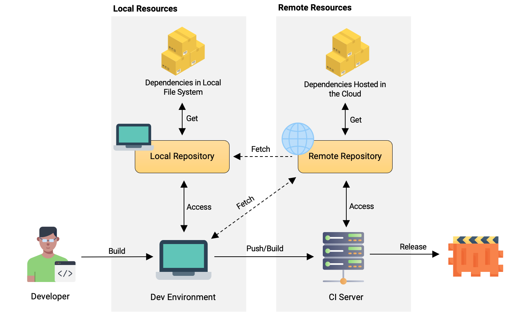

# Introduction

[Package managers](https://en.wikipedia.org/wiki/Package_manager) are software tools used to handle software dependencies in a consistent manner.
Package managers automate the process of installing, upgrading, configuring, and removing dependencies.
They also provide a consistent interface for installing software across different operating systems and distributions.
This chapter describes the use of package managers in software development.

# Categories

There are three categories of package managers: Application Level, System Level, and Language Level.
This section describes the differences between these categories.

## Application Level

The following figure illustrate the use of a package manager to build a software project:

|

There are three key elements in the figure: the local repository and the remote repository.
The local repository is the local cache of the package manager.
The remote repository is the remote cache of the package manager.
And the software project is the software project that uses the package manager to manage its dependencies.

| Package Manager                      | Description                                                                                                                                                                                                       |
|--------------------------------------|-------------------------------------------------------------------------------------------------------------------------------------------------------------------------------------------------------------------|
| [npm](https://www.npmjs.com/)        | The Advanced Packaging Tool (APT) is a free-software user interface that works with core libraries to handle the installation and removal of software on Debian, Ubuntu and related Linux distributions.          |
| [Maven](https://search.maven.org/)   | The missing package manager for macOS (or Linux).                                                                                                                                                                 |
| [CRAN](https://cran.r-project.org/)  | Yum is a free and open-source command-line package-management utility for computers running Linux operating systems using the RPM Package Manager.                                                                |
 | [RubyGems](https://rubygems.org/)    | The RubyGems package manager is a collection of software development tools that helps you build, install, and manage Ruby applications and libraries.                                                             |
 | [NuGet](https://www.nuget.org/)      | NuGet is the package manager for .NET. The NuGet client tools provide the ability to produce and consume packages. The NuGet Gallery is the central package repository used by all package authors and consumers. |
 | [Pip](https://pypi.org/)             | The Python Package Index (PyPI) is a repository of software for the Python programming language.                                                                                                                  |
 | [Cargo](https://crates.io/)          | Cargo is the Rust package manager.                                                                                                                                                                                |
 | [Go](https://golang.org/)            | Go is an open source programming language that makes it easy to build simple, reliable, and efficient software.                                                                                                   |
 | [Bower](https://bower.io/)           | A package manager for the web.                                                                                                                                                                                    |
 | [Composer](https://getcomposer.org/) | Dependency Manager for PHP                                                                                                                                                                                        |
 | [Yarn](https://yarnpkg.com/)         | Fast, reliable, and secure dependency management.                                                                                                                                                                 |
 | [Pub](https://pub.dev/)              | Pub is the package manager for the Dart programming language, containing reusable libraries & packages for Flutter, AngularDart, and general Dart programs.                                                       |
 | [CPAN](https://www.cpan.org/)        | The Comprehensive Perl Archive Network (CPAN) is a repository of software for the Perl programming language.                                                                                                      |

## System Level

| Package Manager                                       | Description                                                                                                                                                                                              |
|-------------------------------------------------------|----------------------------------------------------------------------------------------------------------------------------------------------------------------------------------------------------------|
| [apt](https://wiki.debian.org/Apt)                    | The Advanced Packaging Tool (APT) is a free-software user interface that works with core libraries to handle the installation and removal of software on Debian, Ubuntu and related Linux distributions. |
| [Homebrew](https://brew.sh/)                          | The missing package manager for macOS (or Linux).                                                                                                                                                        |
| [yum](http://yum.baseurl.org/)                        | Yum is a free and open-source command-line package-management utility for computers running Linux operating systems using the RPM Package Manager.                                                       |
| [zypper](https://en.opensuse.org/SDB:Zypper_manual)   | Zypper is a command-line package manager for RPM-based Linux distributions.                                                                                                                              |
| [pacman](https://wiki.archlinux.org/index.php/Pacman) | Pacman is a free and open-source package manager for Linux distributions.                                                                                                                                |
 | [nix](https://nixos.org/nix/)                         | Nix is a package manager for Linux and other Unix systems that makes package management reliable and reproducible.                                                                                       |
 | [guix](https://www.gnu.org/software/guix/)            | Guix is a functional package manager: it provides a purely functional package description language, a deterministic build system, and an expressive package management system.                           |
 | [snap](https://snapcraft.io/)                         | Snap is a package management system developed by Canonical Ltd. for Linux distributions that use the systemd init system and the AppArmor security system.                                               |
 | [flatpak](https://flatpak.org/)                       | Flatpak is a software utility for software deployment, package management, and application virtualization for Linux desktop computers.                                                                   |

## Deployment Level

| Package Manager                                      | Description                                                                                                                                                                                              |
|------------------------------------------------------|----------------------------------------------------------------------------------------------------------------------------------------------------------------------------------------------------------|
| [Docker Hub](https://hub.docker.com/                 | The Advanced Packaging Tool (APT) is a free-software user interface that works with core libraries to handle the installation and removal of software on Debian, Ubuntu and related Linux distributions. |
| [Docker Registry](https://docs.docker.com/registry/) | The missing package manager for macOS (or Linux).                                                                                                                                                        |
| [Quay](https://quay.io/)                             | Yum is a free and open-source command-line package-management utility for computers running Linux operating systems using the RPM Package Manager.                                                       |
| [GitHub Container Registry]()                        | TODO                                                                                                                                                                                                     |

# Dependencies

The dependency code constitutes your dependencies. 
It shouldn’t be mutated during the lifetime of your application, and should be accessible by your project code in memory when it’s needed.

## Dependency Resolution Mechanism

## Direct and Transitive Dependencies

https://www.freecodecamp.org/news/javascript-package-managers-101-9afd926add0a#.hu6knvct3

# Software ecosystem

[Software repositories](https://en.wikipedia.org/wiki/Software_repository) is a storage location for software packages.

Package managers are immutable, which leads to natural software diversity.[^1]

Software ecosystems are...[^2]

# Beginner, Normal, Expert Level

# Industry Use Cases

Package managers are designed to eliminate the need for manual installs and updates. 
This can be particularly useful for large enterprises whose operating systems typically consist of hundreds or even tens of thousands of distinct software packages.

# Test Questions / Areas / Learning Goal

# References

[^1]: Soto-Valero, César, et al. "The emergence of software diversity in maven central." 2019 IEEE/ACM 16th International Conference on Mining Software Repositories (MSR). IEEE, 2019.
[^2]: Decan, Alexandre, Tom Mens, and Philippe Grosjean. "An empirical comparison of dependency network evolution in seven software packaging ecosystems." Empirical Software Engineering 24.1 (2019): 381-416.

