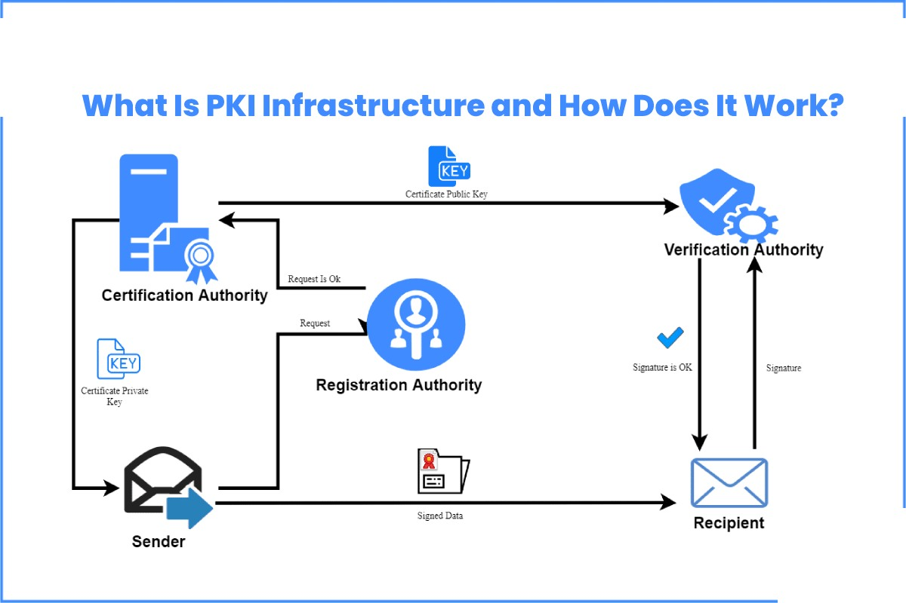
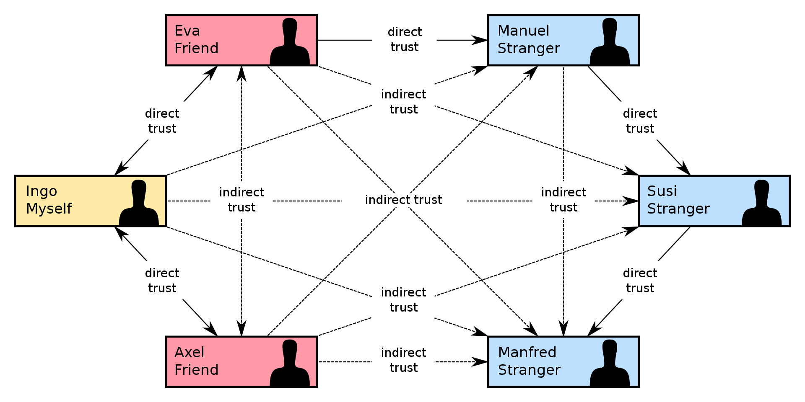
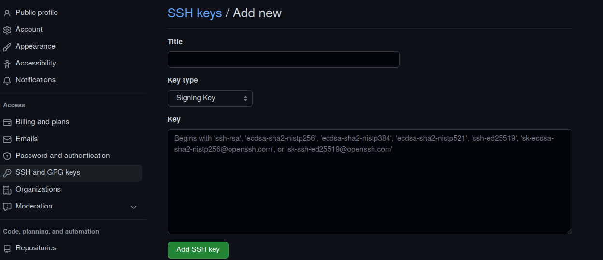
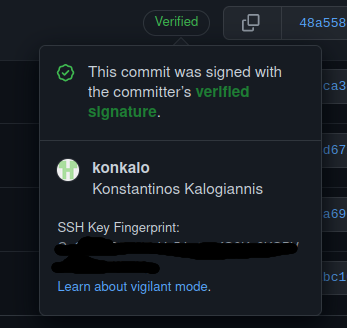

---


layout: default
title: Security in code infrastructure
nav_order: 5
description: ""
permalink: /security
---

# Security in code infrastructure

## Credential Management

### Public Key infrastructure

Before delving into the finer details of securing the code infrastructure, we need to first discuss one of the basics components of access control and code attestation, among other things. Public Key Infrastructure (PKI) is a set of entities, with distinct roles, responsible for 
managing digital certificates; this includes, their generation, storage, distribution and most importantly revocation. These certificates can then be used to authenticate a user, or a machine, to a service.

The following is a simple illustration of the role of the PKI. The goal is to tie the keys used to encrypt the transmitted data to the sender and the receiver.

 |
|:--:|
| *Image source: https://www.technologyies.com/what-is-pki-infrastructure-and-how-does-it-work/*

PKI ensures that the `public` keys used to communicate with a server, a company, or an individual, belongs to the actual owner. As long as the certificate authority is trusted, a user can be sure that the communication happens with the intended recipient. 

To bring it to the context of supply chains: PKI helps ensure that the downloaded software was produced by a specific entity; it can also ensure that the code has not been changed during the lifetime of the supply chain (if signing/verification happens at each step); it can also be used to connect published code to a specific individual.   We can see in the following picture the need for an infrastructure that takes care of authentication. In the real world, the driver would provide an ID to the factory and the store. In the software supply chain, this is accomplished with the use of credentials.

 |
|:--:|
| *Image source: https://www.docker.com/blog/*

### Public Key Encryption
The PKI also facilitates the use of assymetric encryption, known also as public key encryption (PKE). In this scheme, each user has two distinct keys; one is `public`, the other must always remain `private`. The public key can be freely distributed to the world and is required to `verify` that a piece of software was `signed` (or encrypted) by the corresponding private key. This, highlights the importance of keeping the private key secure; leaking this key would allow anyone to impersonate its actual holder. 

In the context of code infrastructure security, a compromised `private` key would allow anyone to `push` to a specific branch, `sign` the code to appear to originate from someone else, e.g., Linus Torvald, and ultimately introduce malicious code into the supply chain.

### Web of Trust
Yet, PKI is not necessarily needed for attesting code and infrastructure. A user can distribute its public key and sign his code/work with a private key. The public key can then be used to verify that the code was submitted using the corresponding private key.

This, however, does not link the public key with an individual; when PKI is not used, the alternative is to create a `web of trust`. In simple words, in this `decentralized` model, each user can endorse the association between a public key and a person; this way indirect trust can be achieved. The following image illustrates this:

|
|:--:|
| *Image source: https://en.wikipedia.org/wiki/Web_of_trust*

### Credential handling
Due to its nature, improper handling of credentials can lead to serious damage; moreso, when the credentials ensure the security and integrity of a supply chain.

The simplest steps for credential management can be summarized as:
- Private keys must always remain secret.
- When possible, 2FA should be used.
- Keys and credentials should be changed in due time and not be permanent. Similarily, certificates, should have an expiration date.
- Keys should be used for one protocol only (this stops cross-protocol attacks, e.g., [SSL attack](https://www.controlcase.com/cross-protocol-attack-on-tls-using-sslv2-drown-vulnerability-cve-2016-0800-mar-2016/)).

## Access control - 2FA - on the repo
In a typical sense, git does not provide access control; git after all is a source-code management tool. A repository can be private or public but the repositories themselves do not implement any authentication. This can be tackled with other solutions: some [examples](https://wincent.com/wiki/Git_repository_access_control) of this include the use of `git-daemon` to provide read-only (anonymous) access and the requirement of using SSH keys to `push`; users without the appropriate SSH key cannot `push` to the repository.

However, a simple step for improving the security of a repository is to introduce Two-Factor Authentication (2FA) when logging-in into a git account. 2FA effectively requires the user to present two pieces of information to authenticate themselves (e.g., knowledge - a password, and possession - a phone that receives an one-time password). This raises the difficulty of compromising an account and gaining access to critical code. Github provides a detailed guide on how to configure [2FA](https://docs.github.com/en/authentication/securing-your-account-with-two-factor-authentication-2fa/configuring-two-factor-authentication) and its [account-recovery](https://docs.github.com/en/authentication/securing-your-account-with-two-factor-authentication-2fa/configuring-two-factor-authentication-recovery-methods). Accessing the account can be [straightforward](https://docs.github.com/en/authentication/securing-your-account-with-two-factor-authentication-2fa/accessing-github-using-two-factor-authentication) through the web, or through the command line using [SSH](https://docs.github.com/en/authentication/keeping-your-account-and-data-secure/about-authentication-to-github).

### Commit signing

Another usefull service that git allows through the use of `SSH` keys, is the possibility to `sign` code that is `pushed` to a repository. This ensures that all commits are authenticated and the person responsible for the code can be attributed.

In order for a commit to be signed, the `signing` key must be added to the user's account; the procedure is similar to adding a key for authenticating to github.




The following lines enable code signing from the command line ([instructions](https://docs.github.com/en/authentication/managing-commit-signature-verification/telling-git-about-your-signing-key)) and assumes that `SSH` keys have already been created, e.g., for accessing the repository ([SSH key generation](https://docs.github.com/en/authentication/connecting-to-github-with-ssh/generating-a-new-ssh-key-and-adding-it-to-the-ssh-agent), [SSH access](https://docs.github.com/en/authentication/connecting-to-github-with-ssh/adding-a-new-ssh-key-to-your-github-account)).

```
git config commit.gpgsign true
git config gpg.format ssh //when using SSH key instead of GPG
git config user.signingkey "public_key"
```

More information on the proccess of signing commits can be found in the [signing commits](https://docs.github.com/en/authentication/managing-commit-signature-verification/signing-commits) section in github.

### Verify Commits
There are two ways to verify that a commit was signed with a valid key. The most straightfoward option is to visually inspect if the commit has a `Verified' icon next to it in the web interface as shown below.



For a command-line option, git needs to be configured in order to check against the provided public keys. The file must contain at least one principal (e.g., user1@example.com), followed by the associated public key in a single line.
The following commands show the steps required to achieve this.

```
git config gpg.ssh.allowedSignersFile <file>
git verify-commit -v <commit>
```

### Web of Trust
PKI is not necessarily needed  for attesting code and infrastructure. A user can distribute its public key and sign his code/work with a private key. The public key can then be used to verify that the code was submitted using the corresponding private key.

This, however, does not link the public key with an individual; when PKI is not used, the alternative is to create a `web of trust`. In simple words, in this `decentralized` model, each user can endorse the association between a public key and a person; this way indirect trust can be achieved. The following image illustrates this:

 |
|:--:|
| *Image source: https://en.wikipedia.org/wiki/Web_of_trust*


## Beginner, Normal, Expert Level
## Industry Use Cases
## Test Questions / Areas / Learning Goal
## References

1. [Static analysis for security. Brian Chess, Gary McGraw](https://ieeexplore.ieee.org/stamp/stamp.jsp?arnumber=1366126)
2. [Countering trusting trust through diverse double-compiling. David A. Wheeler, 2005.](https://ieeexplore.ieee.org/document/1565233)
3. [Github docs](https://docs.github.com/en)
4. [How PKI works](https://www.thesslstore.com/blog/how-pki-works/)
5. [Git access control examples](https://wincent.com/wiki/Git_repository_access_control)


<!-- [hide email](https://stackoverflow.com/questions/43863522/error-your-push-would-publish-a-private-email-address) -->